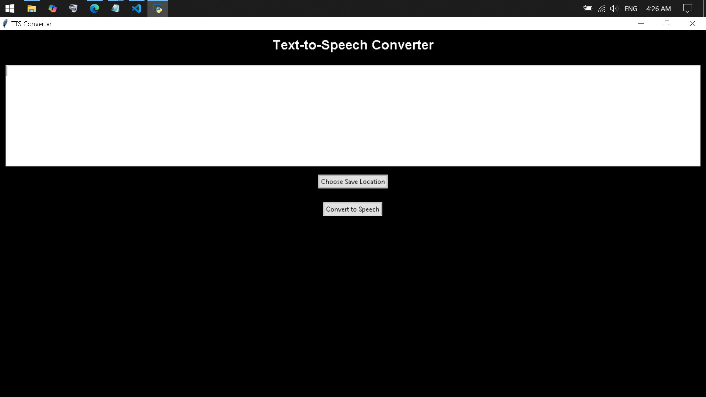

# TTS Converter - Text-to-Speech Tool

A free, fast, and easy-to-use Text-to-Speech (TTS) tool utilizing Microsoft's `TTS_MS_EN-US_DAVID_11.0` voice. This tool allows you to convert text directly into audio files with a simple GUI.

## Features
- **Fast text-to-audio conversion** using Microsoft’s TTS engine.
- **User-friendly interface** to input text and save audio files.
- **Save as MP3** to easily transfer and listen on your devices.

## Use Cases
1. **Listen to Books or Summaries**: Paste in full or summarized book content to generate audio, ideal for listening during:
   - **Transportation** – Enjoy books hands-free while commuting.
   - **Workout/Training** – Use workout time to catch up on content.
   - **Cooking or Cleaning** – Multi-task with a hands-free way to learn.
2. **Summarized Books & Chapters**: Summarize books with tools like NotebookLM, paste summaries, and create audio files for convenient listening.

## Requirements
- **Python**: Make sure Python is installed on your machine. Use the following command to check:

   ```bash
   python --version
   ```

   **Output if Python is installed**:
   ```
   Python (followed by a version number)
   ```

   **Output if Python is NOT installed**:
   ```
   Command not found or unrecognized
   ```

   If not installed, [search "Install Python"](https://www.google.com/search?q=install+python) or follow installation commands below:
   - **MacOS**: `brew install python`
   - **Windows**: [Download Python](https://www.python.org/downloads/) and run the installer.
   - **Linux**: `sudo apt-get install python3`

## How to Run
1. Clone the repository and navigate to the folder:

   ```bash
   git clone <repository_url>
   cd <repository_folder>
   ```

2. Run the following command to start the TTS Converter GUI:

   ```bash
   python tts_converter.py
   ```

## Usage
1. **Enter or paste text** into the provided text area.
2. **Select save location** for the audio file by clicking "Choose Save Location."
3. **Click “Convert to Speech”** to generate the audio file.
4. After conversion, you’ll see a confirmation and the audio file will be saved to the selected location.



Enjoy using TTS Converter to bring your favorite books and summaries to life through audio!
